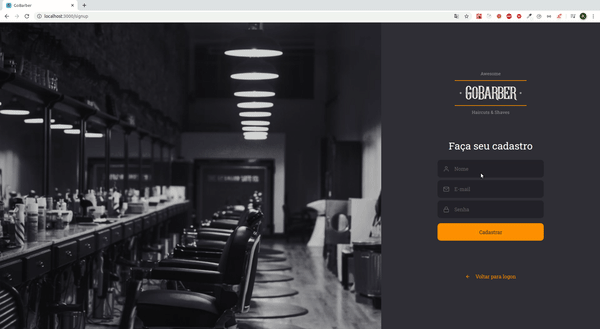
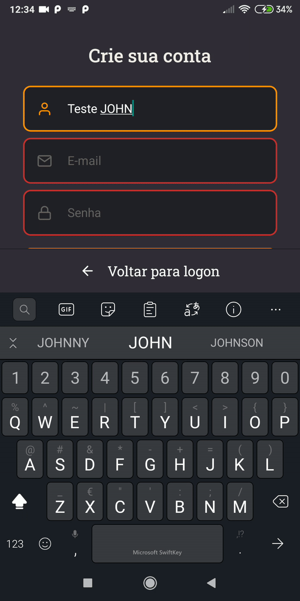

<h1 align="center">
  💈️💇‍♂️️ GoBarber 💇‍♂️️💈️
</h1>

<p align="center">
  

  

  

  <br>

  

  <a href="https://www.linkedin.com/in/ricardo-silva-b40027178/">
    
  </a>
</p>

---

<p align="center">
  

  
</p>

---

# Indice

- :rocket: [Sobre o Projeto](#rocket-sobre-o-projeto)
- 👨‍💻️ [Tecnogias utilizadas](#%EF%B8%8F-tecnogias-utilizadas)
- 📦️ [Como utilizar o projeto](#%EF%B8%8F-como-utilizar-o-projeto)

---

## :rocket: Sobre o Projeto

A proposta do **Bootcamp GoStack** da [Rocketseat](https://rocketseat.com.br/) é desenvolver uma aplicação completa para barbearias e salões de beleza chamada GoBarber, onde os prestadores de serviço possam informar seus dias e horários disponíveis para o trabalho, enquanto os clientes possam optar pelo profissional que melhor se enquadre em sua escolha de dia e horário.

O **GoBarber Server** é a construção de uma API REST (servidor) com o intuito de distribuir os dados para as plataformas tanto WEB como MOBILE.

O **GoBarber Web** é a construção da versão web da aplicação, que será utilizada pelos prestadores de serviço para visualizar os agendamentos e selecionar o horário de atendimento.

O **GoBarber Mobile** é a construção da versão mobile da aplicação , que será utilizada pelos clientes onde irá poder cadastrar o horário de marcação, dentro da disponibilidade de um determinado prestador cadastrado na aplicação.

---

## 👨‍💻️ Tecnogias utilizadas

O projeto foi desenvolvido utilizando as seguintes tecnologias:

- [Node.js](https://nodejs.org/)
- [ReactJS](https://reactjs.org/)
- [React Native](https://reactnative.dev/)
- [TypeScript](https://www.typescriptlang.org/)

### Ferramentas / Dependências

  - [TypeOrm](https://typeorm.io/)
  - [Express](https://expressjs.com/)
  - [Docker](https://www.docker.com/)
  - [Redis](https://redis.io/)
  - [Axios](https://github.com/axios/axios)
  - :clock2: [Date FNS](https://date-fns.org/)
  - :sparkles: [Polished](https://polished.js.org/)
  - [React Day Picker](https://react-day-picker.js.org/)
  - [React Icons](https://react-icons.github.io/react-icons/)
  - [React Router DOM](https://github.com/ReactTraining/react-router#readme)
  - [React Spring](https://www.react-spring.io/)
  - :nail_care: [Styled Components](https://styled-components.com/)
  - [UUIDv4](https://github.com/thenativeweb/uuidv4#readme)
  - [Yup](https://github.com/jquense/yup)
  - ...

### Padronização de código

  - [ESLint](https://eslint.org/)
  - [Prettier](https://prettier.io/)
  - :mouse: [Editor Config](https://editorconfig.org/)

### IDE

  - [Visual Studio Code](https://code.visualstudio.com/)

---

## 📦️ Como utilizar o projeto

Foi utilizado o docker para a criação do banco de dados.

  Criar e startar a base de dados **POSTGRES**:

    docker run --name gobarber -e POSTGRES_PASSWORD=gobarber -p 5432:5432 -d postgres

    docker start gobarber

  Criar e startar a base de dados **REDIS**:

    docker run --name redisgobarber -p 6379:6379 -d -t redis:alpine

    docker start redisgobarber


Para copiar o projeto, utilize os comandos:

```bash
  # Clonar o repositório
  ❯ git clone https://github.com/ricardobron/gobarber2.0.git

  # Entrar no diretório
  ❯ cd gobarber2.0
```

Para instalar as dependências e iniciar o projeto, você pode utilizar o Yarn ou NPM.


## :package: Backend

1. ``cd backend``
2. ``yarn``
3. ``Criar o arquivo .env com base no .env.example``
4. ``yarn sequelize db:migrate``
5. ``yarn sequelize db:seed:all``
6. ``yarn dev``

## 💻 Frontend

1. ``cd frontend``
2. ``yarn``
3. ``yarn start``

## 📱Mobile Apenas testado em Android)

1. ``cd mobile``
2. ``yarn``
4. ``adb reverse tcp:3333 tcp:3333``
5. ``react-native start``
6. ``react-native run-android``

---


<h4 align="center">
  Feito por ricardobron 👋️ <a href="mailto:ricardoslv688@gmail.com">Entre em contato!</a>
</h4>

<p align="center">
  <a href="https://www.linkedin.com/in/ricardo-silva-b40027178/">
    
  </a>
</p>